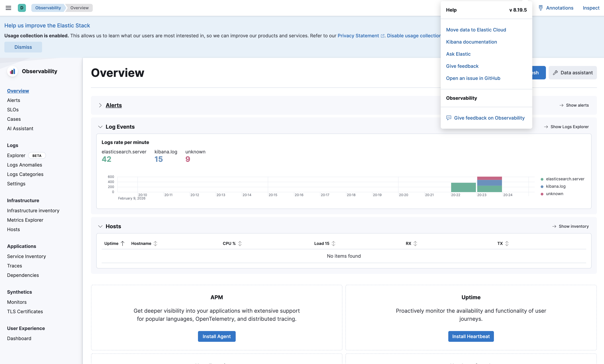
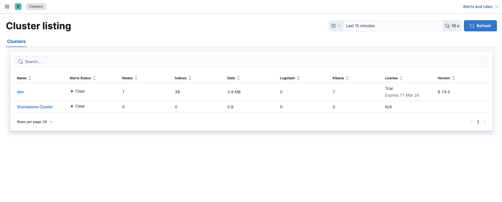
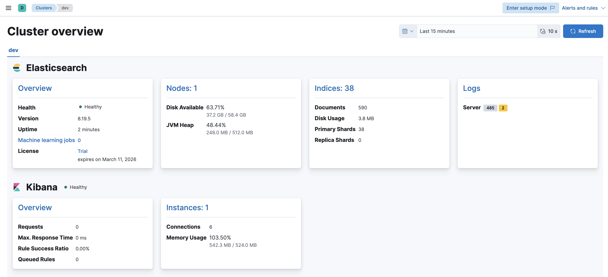
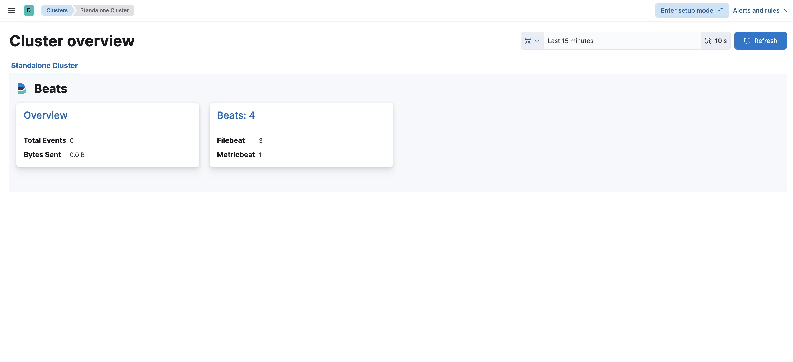

# ES K8s Monitoring

Local k3d Kubernetes cluster running two Elasticsearch + Kibana stacks:

- **Monitoring** (`monitoring` namespace) - receives and displays monitoring data
- **Dev** (`dev` namespace) - development ES+KB stack whose metrics and logs are shipped to the monitoring cluster

Metricbeat collects ES/KB metrics from the dev cluster and Filebeat ships container logs, both sending data to the monitoring cluster's Elasticsearch. Kibana Stack Monitoring visualizes everything.

## Prerequisites

- [Docker](https://docs.docker.com/get-docker/)
- [k3d](https://k3d.io/) (v5+)
- [kubectl](https://kubernetes.io/docs/tasks/tools/)
- `curl`, `python3`

## Quick Start

```bash
make setup      # creates cluster + deploys everything
make info       # print access URLs + credentials
make verify     # run health checks
make teardown   # delete the cluster
```

Or run directly:

```bash
./setup.sh
```

To override the detected IP:

```bash
INTERFACE_IP=192.168.1.100 ./setup.sh
```

To override the Elastic Stack version (defaults to `8.19.11`):

```bash
ELASTIC_VERSION=8.19.11 ./setup.sh
```

## Start/Stop Cheatsheet

```bash
make start   # alias for setup
make stop    # alias for teardown
make info    # URLs + credentials
```

To set the Elastic Stack version via Make:

```bash
make setup ELASTIC_VERSION=8.19.11
```

## Architecture

```
k3d cluster "es-mon" (1 server + 2 agents)
├── kube-system/
│   └── Traefik (built-in ingress controller)
├── monitoring/
│   ├── Elasticsearch (StatefulSet, cluster.name=monitoring)
│   └── Kibana (Deployment, Stack Monitoring UI)
└── dev/
    ├── Elasticsearch (StatefulSet, cluster.name=dev)
    ├── Kibana (Deployment)
    ├── Metricbeat (Deployment) → ships ES/KB xpack metrics to monitoring ES
    └── Filebeat (DaemonSet) → ships dev container logs to monitoring ES
```

All traffic routes through Traefik ingress using sslip.io wildcard DNS.

## Access URLs

URLs are generated at runtime based on your machine IP and `sslip.io` wildcard DNS. Use `make urls` (or `make info`) to print the correct URLs for your environment.

How it works:
1. `setup.sh` detects your IP (or uses `INTERFACE_IP` if provided).
2. The IP is converted to dashed form (e.g., `10.0.10.11` → `10-0-10-11`).
3. Ingress hostnames are generated as `*-<dashed-ip>.sslip.io`.
4. `make urls` repeats the same IP detection and prints the full URLs.

## Screenshots

Monitoring and log ingestion working:






## Make Targets

| Target | Description |
|--------|-------------|
| `make setup` | Run full setup (create cluster + deploy stacks) |
| `make teardown` | Delete the k3d cluster |
| `make status` | Show pod status across namespaces |
| `make verify` | Run health checks against all endpoints |
| `make urls` | Print access URLs |
| `make logs-mon-es` | Tail monitoring ES logs |
| `make logs-mon-kb` | Tail monitoring Kibana logs |
| `make logs-dev-es` | Tail dev ES logs |
| `make logs-dev-kb` | Tail dev Kibana logs |
| `make logs-metricbeat` | Tail Metricbeat logs |
| `make logs-filebeat` | Tail Filebeat logs |

## Stack Details

- **Elastic Stack version:** 8.19.11
- **Security:** enabled (`xpack.security.enabled: true`) for local dev use (HTTP/transport SSL disabled)
- **Licensing:** self-generated trial licenses enabled on both ES clusters
- **Monitoring collection:** disabled on both ES clusters (Metricbeat handles collection)
- **ES Java heap:** 512MB per instance
- **Storage:** 5Gi PVC per ES instance (k3d local-path provisioner)

## Filebeat Configuration (Why Logs Work)

Filebeat runs as a DaemonSet in the `dev` namespace and ships logs to the **monitoring** cluster. The configuration is tuned for Kubernetes container logs and Elastic Stack Monitoring:

- **Module-based parsing:** The `elasticsearch` and `kibana` modules are enabled to parse stack logs into ECS fields, which is what Stack Monitoring expects.
- **Container log paths:** Module inputs are overridden to read `/var/log/containers/*dev*elasticsearch*.log` and `/var/log/containers/*dev*kibana*.log`.
- **JSON handling:** Inputs do not force JSON decoding; the modules' ingest pipelines parse JSON when present and tolerate plain-text startup lines.
- **Noise reduction:** Two noisy Kibana startup lines are dropped so logs stay clean in the UI.
- **Data stream:** Filebeat writes to the default `filebeat-8.19.11` data stream (no custom index). This ensures Stack Monitoring can find logs.
- **No replicas:** Template settings set `index.number_of_replicas: 0` for the Filebeat data stream.
- **Beats self-monitoring:** Filebeat ships its own monitoring metrics to the monitoring cluster (`monitoring.enabled: true`).

## Troubleshooting

**Pods stuck in Pending:** Check PVC status with `kubectl get pvc -A`. k3d's local-path provisioner may need a moment.

**ES CrashLoopBackOff:** Check logs with `make logs-mon-es` or `make logs-dev-es`. Common cause is insufficient memory; ensure Docker has at least 6GB RAM allocated.

**Ingress not routing:** Verify Traefik is running: `kubectl get pods -n kube-system`. Check ingress rules: `kubectl get ingress -A`.

**No monitoring data in Kibana:** Verify Metricbeat is running (`make logs-metricbeat`). Check that monitoring ES has `.monitoring-*` indices: `make verify`.

**sslip.io DNS not resolving:** Some networks block wildcard DNS. As a workaround, add entries to `/etc/hosts` mapping the sslip.io domains to `127.0.0.1`.
